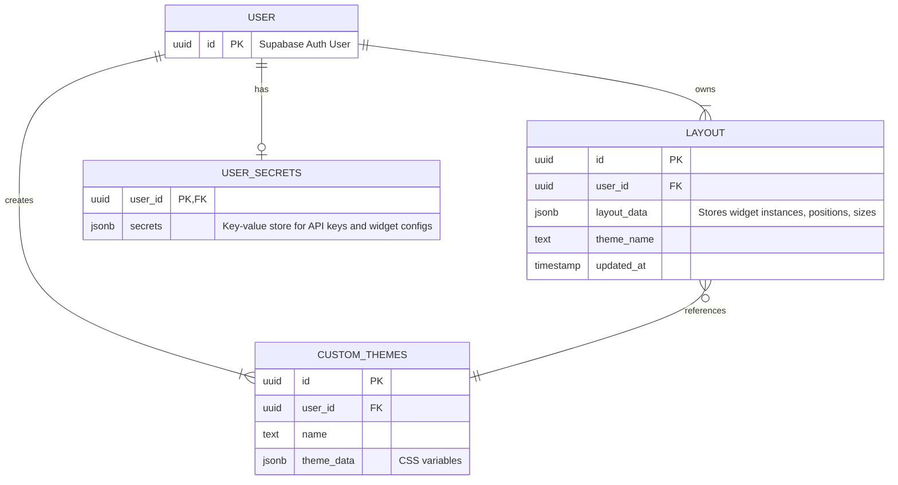

Das Datenmodell ist auf Flexibilität und Skalierbarkeit ausgelegt. Es kombiniert relationale Tabellen für klar strukturierte Daten mit JSONB-Feldern für flexible, semi-strukturierte Konfigurationen. Die Datenisolation wird durch Row-Level Security (RLS) Policies in Supabase sichergestellt.

### Entity-Relationship-Diagramm (Physisches Modell)

Das Diagramm zeigt die primären SQL-Tabellen und ihre Beziehungen.

### Logische vs. Physische Entitäten

-   **Physische Entitäten:** Die oben gezeigten Tabellen (`USER`, `LAYOUT`, `USER_SECRETS`, `CUSTOM_THEMES`) existieren physisch in der PostgreSQL-Datenbank.
-   **Logische Entitäten:** Konzepte wie `StoredWidget` sind logische Entitäten. Eine `StoredWidget`-Instanz wird nicht in einer eigenen Tabelle gespeichert, sondern als JSON-Objekt innerhalb des `layout_data` JSONB-Feldes der [Layout](../entities/layout.md)-Tabelle.

### Design-Begründung

-   **`LAYOUT.layout_data` (JSONB):** Speichert ein Array von Widget-Instanzen. Dies ermöglicht flexible Layout-Änderungen ohne Schema-Migrationen.
-   **`USER_SECRETS.secrets` (JSONB):** Dient als flexibler und sicherer "Tresor" für alle Widget-Konfigurationen und API-Schlüssel. Der Schlüssel im JSON-Objekt ist typischerweise die ID der Widget-Instanz. Dieses Design ist entscheidend für die einfache Erweiterbarkeit des Systems um neue Widgets. Siehe [UserSecrets](../entities/user-secrets.md) für Details.