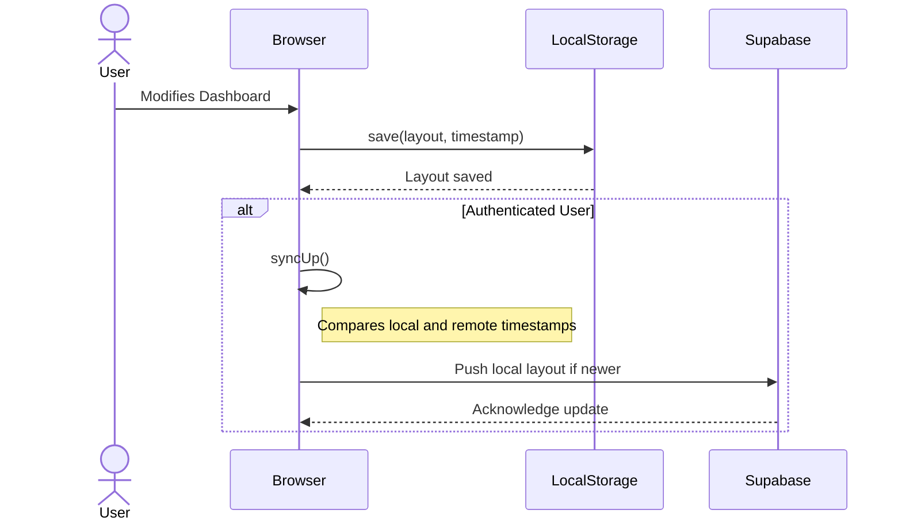

Das Local-First-Muster ist eine Kernentscheidung, um eine hochperformante und offlinefähige Anwendung zu gewährleisten.

### Funktionsweise

1.  **Primärer Speicher:** `localStorage` im Browser ist der primäre und sofortige Speicher für alle Zustandsänderungen (z.B. Widget-Positionen, Konfigurationen). Jede Benutzerinteraktion wird direkt hier gespeichert, was zu einer Latenz-freien Erfahrung führt.

2.  **Optionale Synchronisation:** Für authentifizierte Benutzer wird ein Synchronisationsprozess initiiert. Dieser Prozess ist asynchron und blockiert die UI nicht.

3.  **Konfliktauflösung:** Die Konfliktauflösung zwischen lokalem und Cloud-Zustand erfolgt über Zeitstempel. Beim Laden der Anwendung werden die Timestamps des lokalen und des Remote-Layouts verglichen. In der Regel hat der neuere Zustand Vorrang, um Datenverlust zu vermeiden. Eine Ausnahme besteht bei der erstmaligen Anmeldung, bei der der Cloud-Zustand priorisiert wird.

### Synchronisationsfluss

Das folgende Diagramm illustriert den grundlegenden Ablauf bei einer Zustandsänderung und der anschließenden Synchronisation.

### Vorteile
- **Performance:** UI-Interaktionen sind sofortig.
- **Offline-Fähigkeit:** Die Kernfunktionalität des Dashboards bleibt auch ohne Netzwerkverbindung erhalten.
- **Datenhoheit:** Benutzer ohne Account behalten ihre Daten ausschließlich lokal.

### Risiken
Die Komplexität der Synchronisations- und Konfliktlösungslogik ist ein [identifiziertes Hauptrisiko](../concepts/risk-analysis.md).